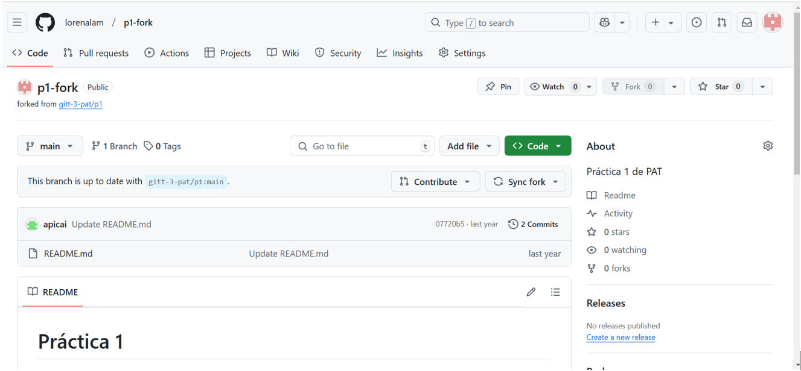

# p1

**PRÁCTICA 1 PAT**

**COMANDOS GIT**

**1.Desde la cuenta de Github hacer un "fork" del repositorio:  https://github.com/gitt-3-pat/p1**
 

**2. Prueba los siguientes comandos sobre el anterior repositorio:
git clone**
 
Sirve para clonar/copiar un repositorio existente en un nuevo directorio, en este caso gitt-3-pat en p1

*git status*
 
Muestra el estado del directorio de trabajo, en este caso esta actualizado con el origin/main. También incluye lo que ha ocurrido con los comandos git commit y git add.
Vemos como al crear un archivo nuevo llamado prueba al hacer git satus cambia
 

*git add*

Añade todos los cambios realizados en los archivos de un directorio como por ejemplo nuevos archivos creados, cambios en existentes o archivos eliminados.
El punto (.) indica que queremos incluir todos los archivos y cambios que se han hecho del directorio actual y sus subdirectorio. Básicamente, prepara esos archivos para ser committed.

*git commit*
 
Con esto guardamos los cambios realizados en el repositorio mediante git add y con el -m damos una descripción del cambio. 

*git push*
 
Subimos los commits al repositorio remoto 

*git checkout*
 
Con este comando nos podemos mover entre ramas o con la variante -b nombrerama crear una nueva rama a la que movernos y empezar a trabajar. En este caso 1 creamos y nos movemos a la rama ‘nuevarama’ y luego volvemos a la rama original ‘main’

**INSTALACIÓN ENTORNO DE DESARROLLO JAVA**

Ya tenía instalada la versión 19.0.2 en mi ordenador.
 
También tenía instalada la versión 2023 de IntelliJ
 
Procedo a la instalación de Maven y VsCode.
Prueba instalación VsCode
 
